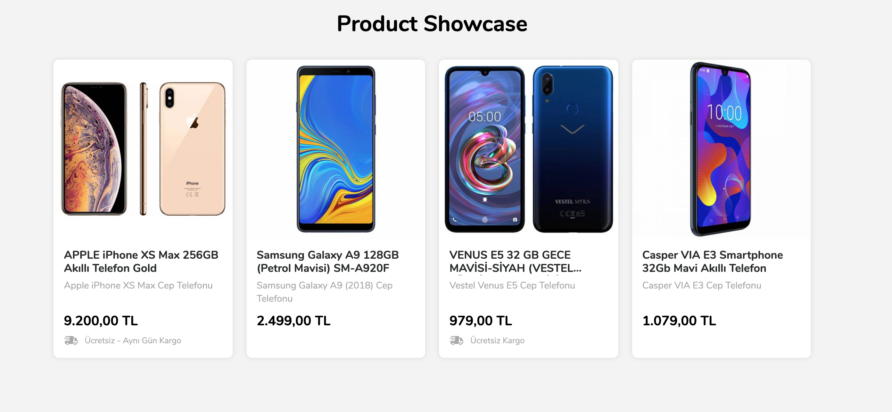

# Product Showcase Client

**Product List Page**



**Product Price Detail**


## Tech Stack

- <a href="https://tr.reactjs.org/">React</a>
- <a href="https://webpack.js.org/">Webpack</a>
- <a href="https://graphql.org/">GraphQL</a>
- <a href="https://www.apollographql.com/docs/react/">Apollo Client</a>
- <a href="https://www.styled-components.com/">Styled-Component</a>
- <a href="https://recharts.org/en-US/">Recharts</a>
- <a href="https://jestjs.io/">Jest</a>
- <a href="https://airbnb.io/enzyme/">Enzyme</a>

## Avaible Scripts

Install dependencies 
```shell
npm install
```

Start webpack dev server 
```shell
npm start
```

Run tests
```shell
npm run test
```

Watch tests
```shell
npm npm run test:watch
```

Run tests with coverage
```shell
npm npm run test:coverage
```